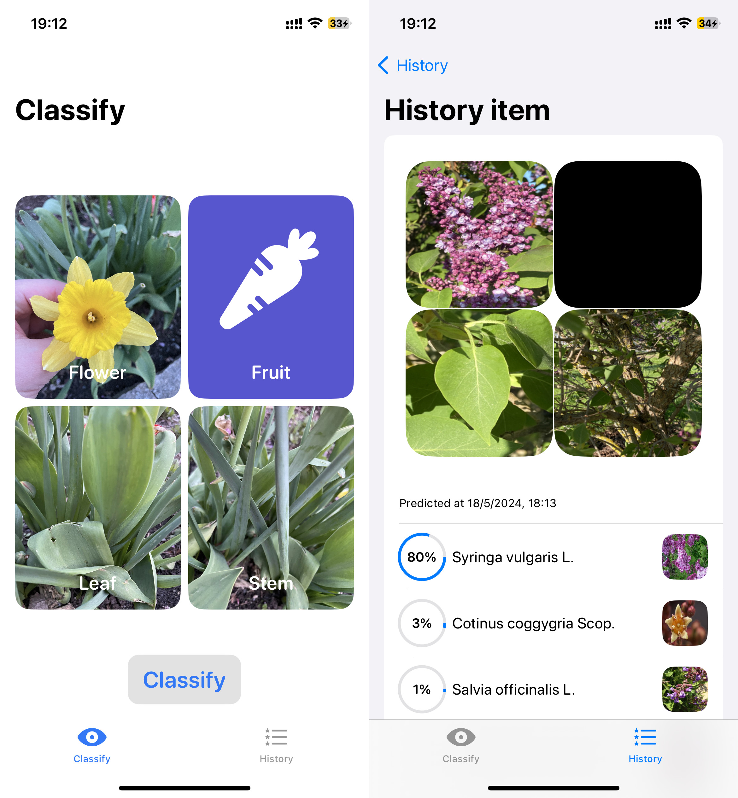

# Source code of a sample iOS app for the paper "Automatic Fused Multimodal Deep Learning for Plant Identification"

## Alfreds Lapkovskis, Natalia Nefedova & Ali Beikmohammadi (2024)

##### URL: https://www.frontiersin.org/journals/plant-science/articles/10.3389/fpls.2025.1616020/full

##### Please check the main repository of the project: https://github.com/AlfredsLapkovskis/MultimodalPlantClassifier.

# Citation

Lapkovskis A, Nefedova N and Beikmohammadi A (2025) Automatic fused multimodal deep learning for plant identification. _Front. Plant Sci._ 16:1616020. doi: 10.3389/fpls.2025.1616020

BibTeX:
```
@article{lapkovskis16automatic,
  title={Automatic fused multimodal deep learning for plant identification},
  author={Lapkovskis, Alfreds and Nefedova, Natalia and Beikmohammadi, Ali},
  journal={Frontiers in Plant Science},
  volume={16},
  pages={1616020},
  year={2025},
  issn={1664-462X},
  publisher={Frontiers},
  doi={https://doi.org/10.3389/fpls.2025.1616020},
  url={https://www.frontiersin.org/journals/plant-science/articles/10.3389/fpls.2025.1616020/full}
}
```

# Screenshots



The app contains modified images from PlantCLEF2015 dataset (https://www.imageclef.org/lifeclef/2015/plant).
